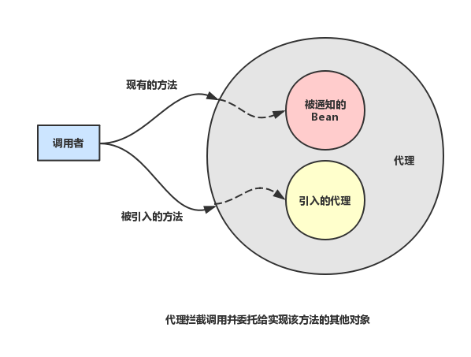

# AOP
AOP，面向切面变成，将系统公共服务（例如，日志记录、事务管理、缓存、性能监测等）从核心业务逻辑中剥离出封装成独立的模块（切面）。
> AOP的具体实现由两种：编译期静态织入和运行期动态代理。

**AspectJ** 是一个基于 Java 语言的 AOP 框架，提供了强大的 AOP 功能，其他很多 AOP 框架都借鉴或采纳其中的一些思想。
AspectJ是通过特殊命令在**编译时**对目标类进行增强。

与 AspectJ 相同的是，**Spring AOP** 同样需要对目标类进行增强，也就是生成新的 AOP 代理类；与 AspectJ 不同的是，Spring AOP 无需使用任何特殊命令对 Java 源代码进行编译，它采用**运行时**动态地、在内存中临时生成“代理类”的方式来生成 AOP 代理。

# Spring AOP
Spring AOP的原理：通过动态代理生成代理对象，代理对象的方法则通过在目标对象的切入点动态织入增强处理，从而完成对目标方法的增强。

Spring 允许使用 AspectJ Annotation 用于定义切面（Aspect）、切入点（Pointcut）和增强处理（Advice），Spring 框架则可识别并根据这些 Annotation 来生成 AOP 代理。Spring 只是使用了和 AspectJ 5一样的注解，但并没有使用 AspectJ 的编译器或者织入器（Weaver），底层依然使用的是 Spring AOP，依然是在运行时动态生成 AOP 代理，并不依赖于 AspectJ 的编译器或者织入器。

## Spring中启用对 @AspectJ配置的支持
需要在Spring XML配置文件中添加`<aop:aspectj-autoproxy/>`或者在Spring的JavaConfig中的配置类上使用`@EnableAspectJAutoProxy`注解启用自动代理功能。

启动对 @AspectJ 的支持后，可以给Bean添加`@Aspect`注解，Spring会自动识别该Bean并将其作为切面(Aspect)处理。

> 当某个Bean被`@Aspect`注解后，Spring容器不会再对该Bean进行增强。

Spring AOP 框架对 AOP 代理类的处理原则是：如果目标对象的实现类实现了接口，Spring AOP 将会采用 **JDK 动态代理**来生成 AOP 代理类；如果目标对象的实现类没有实现接口，Spring AOP 将会采用 **CGLIB** 来生成 AOP 代理类——不过这个选择过程对开发者完全透明、开发者也无需关心。

相关：[Java动态代理](https://rogerfang.github.io/2016/12/31/Java-%E5%8A%A8%E6%80%81%E4%BB%A3%E7%90%86%E4%B8%8E%E5%8F%8D%E5%B0%84/)

## 通知
1.传统Spring AOP通知接口

| 通知 | 接口 | 描述 |
|--------|--------|------|
|前置通知|MethodBeforeAdvice|目标方法执行前实施增强|
|后置通知|AfterReturningAdvice|目标方法执行后实施增强|
|环绕通知|MethodInterceptor|目标方法执行前后实施增强|
|异常抛出通知|ThrowsAdvice|目前方法抛出异常后实施增强|
|引入通知|IntroductionInterceptor|在目标类中添加新的方法和属性|

2.AspectJ AOP注解

| 通知 | 接口 | 描述 |
|--------|--------|------|
|前置通知|@Before|相当于 BeforeAdvice|
|后置通知|@AfterReturning|相当于 AfterReturningAdvice|
|环绕通知|@Around|相当于 MethodInterceptor|
|异常抛出通知|@AfterThrowing|相当于 ThrowAdvice|
|引入通知|@DeclareParents|相当于 IntroductionInterceptor|
|最终通知|@After|不管是否异常，通知都会执行|

## 引入通知

通过引入通知来增强被通知的bean，看起来像是增加了新功能。
```java
@Component
@Aspect
public class EncoreableAspect{
	/**
     * value指定哪种类型的Bean需要进行引入增强，“+”表示Performance的所有子类。
     * defaultImpl指定提供引入功能的实现类。
     */
    @DeclareParents(value="concert.Permormance+", defaultImpl=DefaultEncoreable.class)
    public static Encoreable encoreable;
}
```

## 配置切面
### XML配置
1. 传统Spring AOP
	```xml
    <aop:config>
    	<aop:advisor advice-ref=".." point-ref="..">
	</aop:config>
    ```
    定义Spring传统的AOP切面，只支持一个pointcut和一个advice，并且该advice必须实现相应的通知接口。
2. AspectJ AOP
	```xml
    <aop:config>
        <aop:aspect ref="aspect1">
            <aop:pointcut id="pointcut1" expression="execution(...)"/>
            <aop:before method=".." pointcut-ref="pointcut1"/>
            <aop:after-returning method=".." pointcut-ref="pointcut1" returning="rtval"/>
        </aop:aspect>
    </aop:config>
    ```
    定义AspectJ切面的，可以包含多个pointcut和advice，并且advice不需要实现相应的Advice接口，只需要指明对应的方法名。

### 注解配置
```java LogAspect
import org.aspectj.lang.ProceedingJoinPoint;
import org.aspectj.lang.annotation.*;
import org.springframework.beans.factory.annotation.Autowired;
import org.springframework.stereotype.Component;

@Component
@Aspect
public class LogAspect {

    @Pointcut("execution(* com.roger.springaopdemo..*Service.* (..)) && !bean(logService)")
    public void business(){
    }

    @Autowired
    private LogService logService;

    @Before("business()")
    public void before(){
        logService.logTime();
        System.out.println("Logging: before");
    }

    @AfterReturning(value = "business()", returning = "rtval")
    public void afterReturning(Object rtval){
        System.out.println("Logging: after returning");  
    }

    @Around("business()")
    public Object around(ProceedingJoinPoint pjp) throws Throwable {
        System.out.println("Logging: around begin, args:" + pjp.getArgs());
        Object rtval = pjp.proceed();
        System.out.println("Logging: around end");
        return rtval;
    }

    @AfterThrowing(value = "business()", throwing = "ex")
    public void afhterThrowing(Exception ex){
        System.out.println("Logging: after throwing, ex=" + ex.getMessage());
    }

    @After("business()")
    public void after(){
        System.out.println("Logging: after");
    }
}
```

```java UserService
import com.roger.springaopdemo.model.User;
import org.springframework.stereotype.Service;

@Service
public class UserService {

    public User findById(Integer id){
        return new User(1, "Roger", 24);
    }

    public int update(User user){
        return 0;
    }

    public int add(User user){
        return 0;
    }

    public int deleteById(Integer id){
        throw new RuntimeException("Delete Error");
    }
}
```

```java LogService
import org.springframework.stereotype.Service;

@Service
public class LogService {
    public void logTime(){
        System.out.println("Log Time: " + System.currentTimeMillis());
    }
}
```