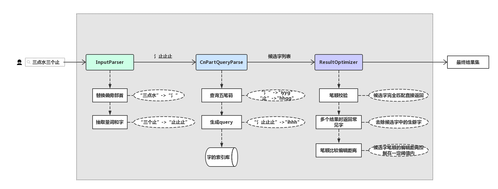

# 解决问题
部分生僻字不知道读音无所搜索，可以根据拆字的方式提供一种解决方案。
例如：`堃`(kūn)字，可以通过`方方土`或者`两个方一个土`的方式搜索到。

# 设计思路
最直接的解决办法是如果有每个汉字的拆字数据，那么就可以直接通过用户输入的拆字部分进行搜索，但是目前还未找到该数据。因而转换另一种间接解决方案，使用五笔码来进行匹配搜索得到相应的汉字，五笔本身反应的是汉字的构造过程，因而适用该问题。


## 数据获取
1. 获取汉字98版五笔数据
2. 获取98版五笔基本码元数据
3. 获取偏旁部首的数据
4. 获取汉字笔顺的数据

## 数据

1. cnpartWords表

  val字段:  
```json
{"code": "wgfh", "structure": "左右结构", "calligraphy": "ノ丨一一丨", "word": "㐵", "description": ""}
```
2. cnpart_base_words(表param)，五笔码元
3. cnpart_common_words(表param)，常见字
4. cnpart_radical(表param)，偏旁部首

对表cnpartWords建索引。

## 设计实现
该功能实现上分为几个模块: 

1. Indexer: 完成cnpartWords建索引的部分。
2. InputParser: 用户输入预处理。
3. CnPartQueryParse: 将预处理后的结果解析成Lucene/ES的查询。
4. CnParamDictLoader: 将param表中的cnpart数据加载到内存中。
5. ResultOptimizer: 搜索结果优化。

## 搜索策略
用户输入 input

1. 用户输入input预处理

  input -> parsedInput
  通过正则抽取量词和字，替换偏旁部首等。
  ```
  eg: 

  "三点水一个木" -> "氵木"
  "两个木一个夕" -> "木木夕"
  ```
2. 将预处理结果parsedInput转换为查询Query

  首先，对parsedInput的每个字查询cnpart索引，得到每个字符的五笔code并暂存到candidates列表，得到输入的笔画顺序。
  然后，根据candidates列表的个数以及cnpart_base_words进行判断来决定如何生成query。
  ```
  eg:

  code: "氵": iyyg, "木": ssss, "夕": qtny, "梦": ssqu, "沐": isy, "口": kkkk, "犬": dgty, "器": kkdk.

  "氵木" -> "is" -> "is?"
  "木木夕" -> "ssq" -> "ssq?"
  "口口犬口口" -> "kkdkk" -> "kkdk"
  ```
3. 根据Query查询索引得到结果
4. ResultOptimizer对结果进行筛选优化，包括一系列步骤：是否完全匹配笔顺，通过一个长点的编辑距离进行笔顺筛选，去出uncommon_words，最后通过一个短点的编辑距离进行笔顺筛选。